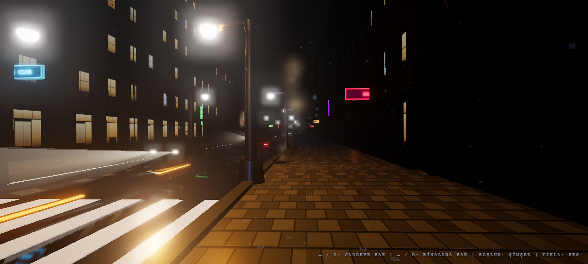
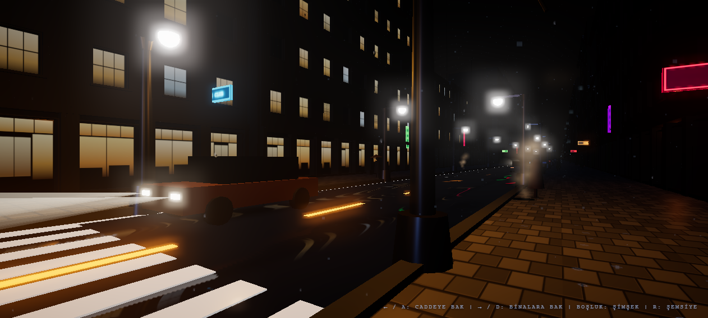
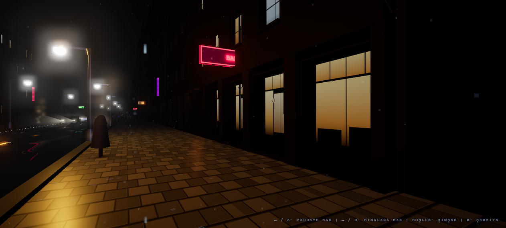
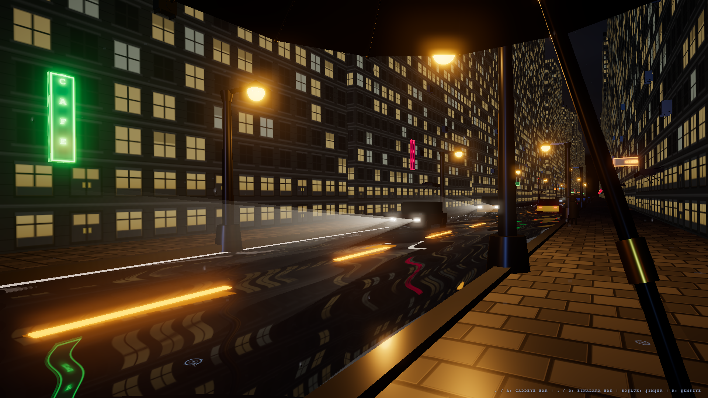
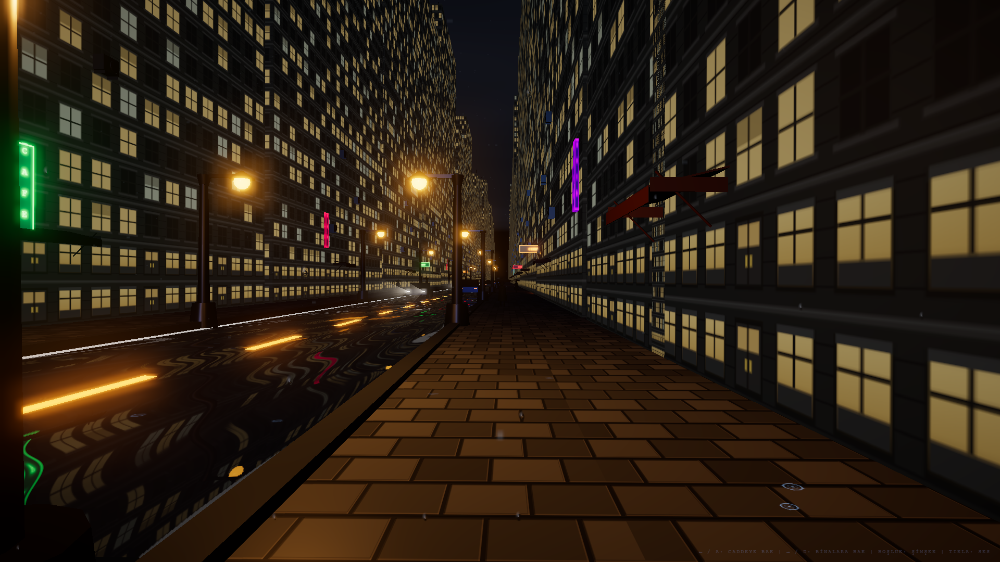

# Rainy Night in 3D: A Cinematic WebGL & Three.js Engineering Case Study

[](https://threejs.org/)
[](https://www.khronos.org/webgl/)
[](https://developer.mozilla.org/en-US/docs/Web/API/Web_Audio_API)
[](https://threejs.org/)
[](https://github.com/)
[](https://github.com/)
[](LICENSE)

> **"From 2D Canvas Projection to an Atmospheric, Living, Production-Grade 3D WebGL Boulevard."**  
> Bu çalışma; p5.js ile yazılmış 2D matematiksel izdüşümlü bir yağmurlu gece sahnesinin, modern WebGL (Three.js r165) grafik boru hattına dönüştürülmesini, asimetrik First-Person POV yürüyüş biyomekaniğini, şemsiye kütle atalet fiziğini, 16-bit HDR post-processing optiklerini, prosedürel Web Audio API ses motorunu ve sıfır-tahsisli (zero-allocation) 60 FPS kilitli mühendislik mimarisini belgeleyen kapsamlı bir teknik vaka analizidir (Case Study).

---

## 🎬 Görsel Önizleme (In-Engine Screenshots)

| 1. Düz İleri Bakış (Forward Perspective) | 2. Cadde & Trafik Akışı (Turn Left) | 3. Mimari Cephe & Ara Sokak (Turn Right) |
| :---: | :---: | :---: |
|  |  |  |

| 4. Biyomekanik Şemsiye Ataleti (Lag Angle) | 5. Fırtına Şimşeği & Bulut Işıması |
| :---: | :---: |
|  |  |

> **Canlı Render Notu:** Yukarıdaki kareler Three.js WebGL motorundan doğrudan 1920x1080 çözünürlükte, 16-bit HalfFloatType HDR boru hattı, ACESFilmic ton eşleme ve UnrealBloom lens difüzyonu eşliğinde canlı olarak kaydedilmiştir.

---

## 🎮 Güncel Kullanıcı Kontrolleri

Arayüz ve etkileşim mantığı, oyuncunun sinematik film noir atmosferine odaklanmasını sağlayacak şekilde optimize edilmiştir:

| Tuş / Etkileşim | Eylem | Teknik Karşılığı |
|---|---|---|
| **`A` / `←` (Sol Yön)** | **Caddeye Bak** | Başımızı sola, ana caddeye, araç farlarına ve karşı kaldırıma çevirir (hedef yaw: $+31.5^\circ \approx +0.55\text{ rad}$). |
| **`D` / `→` (Sağ Yön)** | **Binalara Bak** | Başımızı sağa, butik vitrinlere, neon tabelalara ve ara sokaklara çevirir (hedef yaw: $-31.5^\circ \approx -0.55\text{ rad}$). |
| **Tuş Bırakıldığında** | **Merkeze Dönüş** | Kamera üstel sönümleme ($1 - e^{-8.5\Delta t}$) ile pürüzsüzce ileri bakış eksenine ($0^\circ$) geri döner. |
| **`Boşluk` (Spacebar)** | **Fırtına Şimşeği** | Çift darbeli şimşek arkını tetikler; fırtına bulutları, bina pencereleri, ortam aydınlatması ve 45 Hz sub-bass gök gürültüsü patlar. |
| **Sol Fare Tık (Click)** | **Ses Başlatma** | Web Audio API ses motorunu başlatır (`AudioContext.resume()`). İstem dışı kör edici flaşları önlemek için şimşekten ayrılmıştır; yalnızca ses devreye girer. |
| **`R` Tuşu** | **Şemsiye Silkeleme** | Viewmodel şemsiyeye 0.40 saniyelik sönümlü rotasyonel mikro titreşim (Umbrella Shake vibration: $26\text{ Hz}$, $\exp(-4.8t)$) uygular. |

---

## 🏛️ Temel Mimari ve Mühendislik Prensipleri

### 1. First-Person POV Biyomekaniği ve Şemsiye Ataleti (`main.js` & `scene/walker.js`)

Kameranın ray üzerinde giden mekanik bir robot gibi değil, yağmur altında ıslak kaldırımda yürüyen gerçek bir insan gibi hissettirmesi için biyomekanik bir hareket simülasyonu uygulanmıştır:

* **Kamera Hiyerarşisi ve Güvenlik Koridoru:** Kamera insan göz hizasında ($Y = 1.78\text{ m}$) ve sağ kaldırım emniyet koridorunda ($X_{\text{base}} = -4.50\text{ m}$) konumlandırılmıştır.
* **Asimetrik Biyomekanik Adım Dalgası (Gait Waveform):** Robotik $\sin(t)$ yerine topuk basışında sert iniş ve ağırlık transferinde yumuşak toparlanma sağlayan biyomekanik Fourier eğrisi:
  $$\text{gaitV} = \sin(2\theta) + 0.28\sin(4\theta - 0.40) - 0.10\cos(2\theta)$$
  $$\text{Landing Shock} = \max(0.0, -\text{gaitV} - 0.85) \times 0.008\text{ m}$$
  $$\text{Foot Roll} = 0.018 \sin(\theta - 0.30)\text{ rad}$$
* **İrrasyonel Mikro-Gürültüler (Continuous Micro-Noise):** Birbiriyle harmonik rezonansa girmeyen frekanslar ($0.71, 1.37, 2.83, 0.53, 1.19, 0.61, 1.43\text{ rad/s}$) ile dikey ($N_y$), yanal ($N_x$) ve adım eğimi ($N_{roll}$) eksenlerinde döngüsel periyot tamamen kırılmıştır.
* **Kaldırım Yanal Süzülmesi (Lateral Drift):** Yürüyen karakter $0.12$ ve $0.23\text{ rad/s}$ frekanslarıyla kaldırım üzerinde doğal mikro salınım sergiler. Kesin güvenlik sınırları ile $X \in [-4.65, -4.35]\text{ m}$ koridoruna kilitlenerek dükkan tenteleriyle ($1.95\text{ m}$) ve yol bordürüyle ($1.63\text{ m}$) emniyet mesafesi korunur.
* **Şemsiye Kütle Ataleti (Rotational Drag):** Kafa hızla dönerken ($\lambda = 8.5\text{ s}^{-1}$), kol ve el bileği kütlesi şemsiyeyi gecikmeli olarak sürükler:
  $$\text{\_umbLagYaw} = \text{lerp}(\text{\_umbLagYaw}, \text{headYaw}, 1 - e^{-4.2\Delta t})$$
  $$\text{dragYaw} = \text{\_umbLagYaw} - \text{headYaw}$$
* **Şemsiye Silkeleme Dinamiği (Umbrella Shake Physics):** Kullanıcı `R` tuşuna bastığında şemsiyeye 0.40 saniyelik sönümlü yüksek frekanslı salınım uygulanır:
  $$\theta_{\text{shake}} = 0.052 \cdot e^{-4.8 t} \cdot \sin(26 \cdot 2\pi t)$$
* **Senkronize Yağmur Collider Matrisi:** Şemsiyenin atalet gecikmesi uygulandıktan hemen sonra `_fpsGroup.updateMatrixWorld(true)` çağrılarak kubbe dünya pozisyonu `_umbCenter`'a anında aktarılır; böylece `rain.js` analitik koni damla saptırma simülasyonu gecikmeli şemsiye kütlesiyle kusursuz senkronize çalışır.

---

### 2. 16-Bit HDR Post-Processing Boru Hattı (`scene/postprocessing.js`)

Sahnenin karanlık gece atmosferinde renk basamaklanmasını (banding) engellemek ve yüksek dinamik aralığı korumak için özel bir post-processing mimarisi kurulmuştur:

```
[3D Sahne Renderı] 
        │
        ▼ (16-bit HalfFloatType Buffer)
[UnrealBloomPass] ──► Ampuller, farlar, stoplar ve neonlar parlar (Threshold: 0.78, Strength: 0.52)
        │
        ▼
[RainLensShader]  ──► Ekrana çarpan su damlaları arkadaki ışığı kırar (Refraction Distortion)
        │
        ▼
[CleanVignette]   ──► Sinematik odak düşüşü; saf siyahlar korunur (Darkness: 0.75, Offset: 1.08)
        │
        ▼
[OutputPass]      ──► ACESFilmic Tone Mapping (Exposure: 1.12) + sRGB Renk Uzayı
```

* **HalfFloatType Render Target:** 8-bit quantization kaynaklı gökyüzü sisi ve ıslak asfalt renk basamaklanmasını (color banding) tamamen yok etmek amacıyla `EffectComposer`, `THREE.HalfFloatType` (RGBA 16-bit float) render target ile çalıştırılır.
* **Anti-Nuclear Bloom:** Sahneyi aşırı doygun beyazlığa boğmayan, yalnızca sokak lambası ampulleri (`emissive: 3.8`), araba farları/stopları (`3.4 - 3.8`) ve neon tabelaların (`3.2`) ışık saçtığı dengeli bloom eşiği (`threshold: 0.78, strength: 0.52, radius: 0.55`).
* **RainLensShader (Lens Yağmur Kırılması):** Kamera camına çarpan seyrek yağmur damlacıklarının arkadaki şehir ışıklarını optik olarak kırdığı normal perturbation ve specular parıltı filtresi. `clamp(uv, 0.0, 1.0)` denetimi ile sınır taşmaları ve NaN pikselleri önlenir.
* **CleanVignetteShader (Temiz Vinyet):** Siyahları kaldırmayan, kenarları sinematik bir odakla derinleştiren optimize edilmiş vinyet algoritması.

---

### 3. Saf Web Audio API Prosedürel Ses Motoru (`scene/audio.js`)

Hiçbir harici `.mp3` veya `.wav` ses dosyasına ihtiyaç duymayan, tarayıcının yerel Web Audio API düğümleriyle gerçek zamanlı sentezlenen ses mimarisi:

* **Sıfır Harici Ses Dosyası (0 KB Audio Download):** Ağ gecikmesi ve dosya yükleme bağımlılığı olmadan anında başlar.
* **Sürekli Yağmur Ambiyansı:** Pink Noise üreteci + 750 Hz Lowpass BiquadFilter + rüzgar esintisi modülasyonu (600 - 900 Hz LFO).
* **Islak Adım Sesi (Footsteps):** Asimetrik adım dalgasının yere temas çukurunda ($\text{gaitV} < -0.88$) sol ve sağ ayak için alternatif tetiklenen, su birikintisi şapırtısı ve taban darbesi içeren mikro ses sentezi.
* **Uzak Araba Kornaları:** Rastgele aralıklarla devreye giren çift-tonlu osilatör çiftleri ($392\text{ Hz} + 440\text{ Hz}$).
* **Derin Gök Gürültüsü (Thunder Rumble):** Şimşek anında senkron olarak devreye giren $45\text{ Hz}$ sub-bass darbesi ve $110\text{ Hz}$ yuvarlanan gürültü patlaması (3.5s üstel sönümleme).

---

### 4. Şehir Mimarisi ve Tekil Z-Wrap Senkronizasyonu (`scene/world/` & `scene/ground.js`)

Sonsuz sokak döngüsünde nesnelerin birbirine çarpmasını ve doku atlamalarını önleyen geometri mimarisi:

* **Tekil Senkron Z-Wrap:** Binalar, neon tabelalar, ara sokaklar, tenteler, klima üniteleri ve çatı antenleri `_cityGroup` altında birleştirilmiştir. Grup $240.0\text{ m}$ periyotla akar; her 240m'de 1 blok (8 bina, 4 neon tabela, 3 ara sokak) birebir aynı geometriyle yer değiştirdiği için sahnede $Z=0$'da **0 mm teleportasyon / 0 doku atlaması** sağlanır.
* **No-Glow Roofs (Çatı UV Karartması):** Binaların çatı (Face 2: $+Y$) ve taban (Face 3: $-Y$) yüzeyleri pencere atlasının tamamen siyah ve emissive=0 olan referans paneline ($(0.015, 0.985)$) kilitlenmiştir; çatılarda gökyüzüne bakan parlak pencereler tamamen engellenmiştir.
* **Z-Fighting Çözümü:** Taban asfaltı `baseMesh` $Y = -0.020\text{ m}$'ye çekilmiş ve `_reflector`'a `polygonOffset: true, factor: -1.0, units: -2.0` atanmıştır; 3000 metrelik ufuk boyunca sıfır piksel titremesi garanti edilir.
* **Yaya Koridoru Güvenliği:** Yaya #6 bordür kenarına ($X = -3.35\text{ m}$), Yaya #3 ise ara sokak zeminine ($X = -8.20\text{ m}$) çekilerek kameranın near-plane kesilme riski tamamen ortadan kaldırılmıştır.
* **Sıfır Bellek Tahsisi (Zero-Allocation Loop):** Animasyon ve render döngüsünde (`update` metodları) hiçbir `new THREE.Vector3()` veya geçici nesne oluşturulmaz; tüm hesaplamalar önceden ayrılmış modül-düzeyi tampon vektörler üzerinde çalıştırılır. Garbage Collection (GC) duraklamaları tamamen sıfırlanmıştır.

---

### 5. Modüler Şehir Alt Sistemleri (`scene/world/`)

Bina cephelerinin düz kutu yüzeyinden gerçekçi şehir dokusuna taşınmasını sağlayan, Clean Architecture prensipleriyle ayrıştırılmış modüler alt sistemler:

* **Ana Binalar (`buildings.js`):** 48 bina mimarisi, prosedürel duvar ve pencere atlasları, çatı UV karartması, bina yerleşimi ve Z-wrap senkronizasyonu.
* **Mimari ve Sokak Detayları (`city-details.js`):** Gömme vitrin portalları, çatı korniş silmeleri, yağmur tahliye iniş boruları, çatı detayları ve sokak mobilyalarını yöneten sıfır-tahsisli `InstancedMesh` katmanları.
* **Neon Tabelalar (`neon.js`):** 12 dinamik noir neon tabelası, prosedürel canvas dokuları ve bağımsız Z-wrap akış senkronizasyonu.
* **Ara Sokaklar (`alleys.js`):** 3 atmosferik ara sokak, derinlik illüzyonlu zeminler ve asılı fener aydınlatmaları.
* **Atmosferik Mikro-Detaylar (`atmosphere.js`):** Mazgal buhar bacaları (sinüzoidal dikey ivmeli `Points` parçacıkları) ve tente saçaklarından süzülen sıfır-tahsisli damlacık simülasyonu.
* **Gizemli Noir Yayalar (`pedestrians.js`):** Silüet yayalar, yürüyüş kinematiği ve asenkron adım döngüleri.
* **World Orkestrasyonu (`index.js`):** Alt sistemlerin başlatılmasını (`initWorld`) ve frame başına güncellenmesini (`updateWorld`) koordine eden kamuya açık API katmanı.

---

### 6. Kamera Fiziği, SkyDome ve Şimşek Olay Mimarisi (`scene/walker.js`, `scene/sky.js`, `scene/events.js`)

* **Kamera Yürüyüş Kinematiği ve Şemsiye (`walker.js`):** Adım bobbing ve sway salınımı, klavye/fare etkileşimli kafa dönüşü (`headYaw` sönümlemesi), FPS şemsiye viewmodel'ı, kütle ataleti ve analitik yağmur saptırma collider'ı.
* **Dinamik Fırtına Kubbesi (`sky.js`):** Gökyüzü kubbesi (SkyDome), atmosferik sis entegrasyonu ve şimşek anı tepe aydınlatması.
* **Ayrıştırılmış Şimşek Olay Mimarisi (`events.js`):** Pub/Sub tabanlı şimşek olay mimarisi (`emitLightningFlash`, `subscribeLightning`). `lighting.js` tarafından tetiklenen şimşek darbeleri, gökyüzü (`sky.js`) ve binalara (`buildings.js`) döngüsel bağımlılık olmadan asenkron olarak iletilir.
* **İki Katmanlı Yağmur Hacmi (`rain.js`):** 1600 toplam yağmur parçacığının 450'si kameranın tam önündeki dar hacme ($X \in [-6.6, -2.4]\text{ m}$, $Z \in [-1.2, 9.5]\text{ m}$) özel olarak tahsis edilmiştir. Bu ön hacim damlaları perspektif büyütmesiyle ekranı dolduran sinematik iğne çizgileri oluşturur.
* **Şemsiye Kumaş Ses Sentezi (`audio.js`):** `R` tuşuna basıldığında Web Audio API, frekans süpürmeli yüksek frekanslı gürültü patlaması + ekspansiyel zarf (`BiquadFilter: 900 → 400 Hz`, sönüm: $\exp(-3.2t)$) ile gerçek kumaş titreşimi sesi üretir; herhangi bir `.wav` dosyası kullanılmaz.

---

## 📊 Performans ve Kaynak Karşılaştırması

| Metrik | Eski 2D p5.js | Yeni 3D WebGL (Three.js r165) | Mühendislik Kazancı |
|---|---|---|---|
| **Render Motoru** | 2D CPU Canvas Context | Donanım Hızlandırmalı WebGL 2.0 | GPU Paralelleştirmesi |
| **FPS Kararlılığı (Normal)** | 35 - 50 FPS (Dalgalı) | **60 FPS Kilitli (Locked / 140+ FPS Tepe)** | Akıcı ve Kararlı Kare Zamanı |
| **Düşük Donanım (4x CPU Throttling)** | 8 - 15 FPS (Kullanılamaz) | **Ort. 76.7 FPS / %99.5 > 30 FPS** | Zayıf CPU'larda Dahi Akıcı |
| **Boru Hattı Draw Calls** | N/A (CPU çizim döngüsü) | **~352 Toplam (Çok Geçişli Pipeline)** | Fotogerçekçi PBR ve Yansıma |
| **Binalar, Lambalar & Yol** | 32 Ayrı CPU Döngüsü | **5 Draw Calls** (`InstancedMesh` Grubu) | %85+ CPU İletişim Tasarrufu |
| **Yağmur Parçacıkları** | 420 Damla (CPU çizgi) | **1600 İğne Damla** (450 Ön Hacim + 1150 Ortam) | 4× Yoğunluk, Sinematik Ön Plan |
| **Ses Sistemi** | Ses Yok (Sessiz) | **Saf Prosedürel Web Audio API** | 0 KB Harici Dosya İndirme |
| **Bellek & GC Baskısı**| Yüksek (Geçici Obje Üretimi) | **0 Byte/Frame (Sıfır Bellek Tahsisi)** | GC Duruşları Yok (No Stutters) |

---

## 📂 Proje Dizin Yapısı

```
Animasyon_Ödevi/
│
├── index.html              # Giriş noktası (Three.js r165 ES Module + importmap + HUD)
├── main.js                 # Sahne orkestratörü (Render döngüsü, girdi işleme, modül koordinasyonu)
│
├── scene/
│   ├── sky.js              # Dinamik fırtına gökyüzü kubbesi (SkyDome) ve şimşek aydınlanması
│   ├── lighting.js         # 16 sokak lambası, dinamik 4-PointLight havuzu, çift-darbeli şimşek motoru
│   ├── ground.js           # Yüksek kontrastlı asfalt, granit bordürler, sarı kesikler, Planar Reflector
│   ├── rain.js             # 1600 iğne yağmur sistemi, analitik koni şemsiye saptırma ve zemin sıçramaları
│   ├── traffic.js          # Yoğun şehir trafiği (12 araç), 3 kasa tipi, göreli hız fiziği, far/stoplar
│   ├── walker.js           # Kamera yürüyüş kinematiği (bobbing/sway), etkileşimli kafa dönüşü, FPS şemsiye viewmodel
│   ├── audio.js            # Saf Web Audio API prosedürel ses motoru (yağmur, korna, adım, gök gürültüsü)
│   ├── postprocessing.js   # 16-bit HDR EffectComposer, UnrealBloom, RainLensShader, CleanVignette
│   ├── shadows.js          # 24 instance birleşik temas gölgeleri (araçlar, yayalar, walker)
│   ├── events.js           # Bağımsız Pub/Sub şimşek olay mimarisi (Decoupled Lightning Domain Events)
│   └── world/              # Modüler şehir alt sistemleri:
│       ├── index.js        # World orchestration ve public API katmanı
│       ├── buildings.js    # 48 bina, prosedürel PBR doku atlası, geometri dilimleri ve Z-wrap
│       ├── city-details.js # Gömme vitrin portalları, korniş silmeleri, iniş boruları, çatı mobilyaları
│       ├── neon.js         # 12 dinamik noir neon tabelası, prosedürel canvas dokuları
│       ├── alleys.js       # 3 atmosferik ara sokak, zemin ve asılı fenerler
│       ├── atmosphere.js   # Mazgal buhar bacaları ve tente saçağı damlacık fiziği
│       └── pedestrians.js  # Gizemli noir yayalar ve yürüyüş kinematiği
│
├── docs/
│   └── screenshots/        # Doğrulanmış güncel motor içi ekran görüntüleri (01, 02, 03, diag)
├── scratch/                # CDP doğrulama, döngüsel bağımlılık ve sıfır-tahsis test araçları
│
└── README.md               # Portföy ve mühendislik dokümantasyonu
```

---

## 🚀 Kurulum ve Yerel Çalıştırma

Proje saf ES Modülleri (`import` / `export`) ve WebGL 2.0 kullandığı için `file:///` protokolü yerine yerel bir HTTP sunucusu üzerinden çalıştırılmalıdır:

```bash
# Node.js (npx) ile doğrudan çalıştırma (Önerilen):
npx http-server -p 8080

# Alternatif: Python 3 ile
python -m http.server 8080
```

Ardından tarayıcınızda açın:
```
http://localhost:8080
```

> **Not:** Tarayıcıların "Autoplay Policy" kısıtlamaları gereği Web Audio API ses motoru sayfaya ilk sol tıklandığında devreye girer.

---

## 🔮 Gelecek Geliştirmeler / Future Work (Faz 5: Curved Boulevard & Intersection Architecture)

Projenin bir sonraki teorik vizyonu ve mühendislik yol haritası olarak planlanan **Faz 5**, doğrusal sonsuz cadde geometrisini dinamik bir açık dünya topolojisine taşımayı hedefler:

1. **Eğrilikli Bulvar Geometrisi (Curved Spline Boulevards):**
   - Catmull-Rom veya Bezier spline eğrileri boyunca kıvrılan yol geometrisi.
   - Yolun teğet açısına (tangent alignment) ve bank eğimine (camber) göre otomatik yönelen dinamik bina ve sokak lambası yerleşim matrisleri.
2. **4 Yönlü Akıllı Kavşaklar ve Trafik Sinyalizasyonu (Smart Intersection Architecture):**
   - Zemin katında dönel kavşaklar veya 4 yollu kesişim noktaları.
   - Gerçek zamanlı yeşil/sarı/kırmızı sinyalizasyon döngüsü ve kırmızı ışık algılandığında yumuşak frenleme yapan, yeşil yandığında ivmelenen otonom araç kuyruk fiziği (traffic queuing simulation).
3. **Yaya Geçiş ve Navmesh Yapay Zekası (Pedestrian Crosswalk AI):**
   - Yayaların yalnızca kaldırım üzerinde doğrusal yürümesi yerine yaya geçitlerini (`zebra crossing`) kullanarak karşıdan karşıya geçtiği durum makineleri (Hierarchical State Machines).
   - Yayaların yaklaşan araçları algılayıp durduğu ve araçların yayalara yol verdiği çarpışma önleme protokolleri.
4. **Dinamik Hava Olayları ve Asfalt Kuruma Shader'ı (Dynamic Weather & Puddle Evaporation):**
   - Hafif çiseleyen yağmurdan sağanak fırtınaya dinamik geçişler.
   - Yağmur dindikten sonra asfalt üzerinde oluşan su birikintilerinin buharlaşmasını simüle eden zaman-bağımlı specular/roughness buharlaşma shader katmanı.

---

## 📜 Lisans

Bu proje [MIT Lisansı](LICENSE) altında açık kaynak olarak sunulmaktadır.
